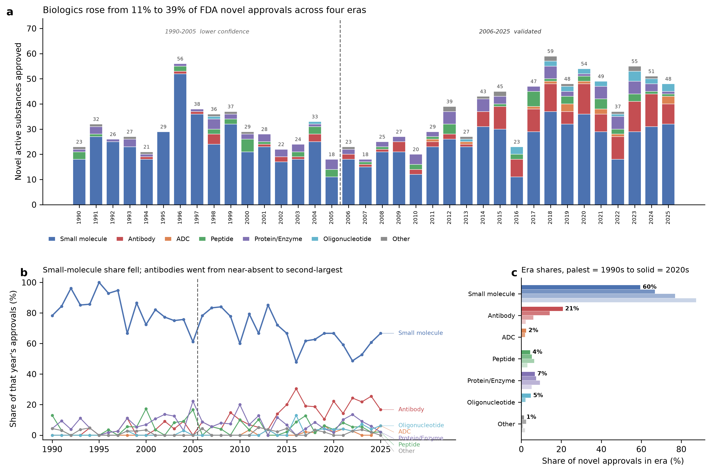

# FDA novel drug approvals and market withdrawals by therapeutic modality, 1990-2025

[](https://doi.org/10.5281/zenodo.23017496)
[](https://mybinder.org/v2/gh/AStevens-code/fda-modality-1990-2025/HEAD?labpath=notebooks%2F01_reproduce_figures.ipynb)
[](https://colab.research.google.com/github/AStevens-code/fda-modality-1990-2025/blob/main/notebooks/01_reproduce_figures.ipynb)
[](https://github.com/AStevens-code/fda-modality-1990-2025/actions/workflows/reproduce.yml)
[](https://creativecommons.org/licenses/by/4.0/)
[](LICENSE-code.txt)

A year-by-year classification of **1,246 novel active substances** approved in the United
States between 1990 and 2025 into seven therapeutic modalities, plus a companion set of
**45 US market withdrawals** over the same window classified on the same scheme.



## Headline findings

- Biologics rose monotonically across four eras: **10.8% -> 22.3% -> 30.8% -> 39.1%** of novel approvals.
- Small-molecule share fell by roughly 28 percentage points over the same period, while
  antibodies went from near-absent to the second-largest class.
- Withdrawals run **28:1** behind approvals. The withdrawal *rate* peaked at
  **6.9%** in 2000-2009, not in the 1990s
  (1990-1999: 3.4%; 2010-2019: 2.4%; 2020-2025: 2.7%).

## Read this before using the data

**The two series in this package are not of equal evidential quality, and the approvals
series is not of equal quality across its own time range.** Three tiers:

| Series | Period | Status |
|---|---|---|
| Approvals | 2006-2025 | **Validated.** r = 0.9992 against FDA's published novel-drug counts; most years match exactly, no year differs by more than 2. |
| Approvals | 1990-2005 | **Lower confidence.** Mean deviation from published counts of the era is ~6x worse. Cause is quantified in `docs/METHODOLOGY_approvals.md`: the source database purges withdrawn products, inconsistently. |
| Withdrawals | 1990-2025 | **Curated, completeness not benchmarkable.** No machine-readable registry of US market withdrawals exists; four candidate sources were tested and rejected (see `validation/withdrawal_source_assessment.csv`). |

Every row in `data/approvals_by_year.csv` and `data/approvals_share_by_year.csv` carries a
`confidence` column so the tier travels with the data. Please keep it when you re-publish.

For the 1990-2005 period we recommend citing **class shares** rather than per-year counts.

## Layout

```
data/          7 analysis-ready tables (the deliverables)
docs/          methodology, reproducibility tiers, known issues, data dictionary,
               deposit runbook, announcement drafts
validation/    the audit trail: checks, reconciliation, exclusion logs, crosswalks
figures/       published figures as PNG
notebooks/     01_reproduce_figures.ipynb - regenerates every figure from data/
src/           pipeline_1990_2025.py - frozen record of the classification code as executed
scripts/       check_reproduction.py - the gate CI runs after executing the notebook
snapshot/      frozen Drugs@FDA pull the analysis was built on (gzipped JSON)
.binder/       environment for one-click execution on mybinder.org
.github/       reproducibility workflow and issue templates for corrections
```

Repository metadata at the root: `requirements.txt` (pinned), `CITATION.cff`,
`datapackage.json` (Frictionless descriptor), `.zenodo.json` (deposit metadata),
`CONTRIBUTING.md`, and the three licence files.

Start with `docs/DATA_DICTIONARY.md` for field-level definitions and
`docs/REPRODUCIBILITY.md` for what can and cannot be re-run.

## File manifest

| file | rows x cols | contents |
|---|---|---|
| `data/approvals_by_era.csv` | 4 x 8 | Novel approvals by modality aggregated into four eras. |
| `data/approvals_by_year.csv` | 36 x 10 | Novel active substances approved per year, by modality, with confidence tier. |
| `data/approvals_share_by_year.csv` | 36 x 9 | Same as approvals_by_year, expressed as percentage shares of each year's total. |
| `data/approvals_substance_level.csv` | 1246 x 11 | One row per novel active substance: identity, approval, modality and how the modality was decided. |
| `data/withdrawal_rate_by_era.csv` | 4 x 4 | Withdrawals as a percentage of approvals, by era. |
| `data/withdrawals_by_year.csv` | 36 x 9 | Curated US market withdrawals per year, by modality. |
| `data/withdrawals_substance_level.csv` | 45 x 13 | One row per withdrawal: drug, year, modality, basis, reason, and cross-checks. |
| `validation/chembl_crosswalk.csv` | 766 x 6 | Frozen ChEMBL lookup: moiety to ChEMBL id, type and first-approval year. |
| `validation/exclusion_log_full.csv` | 1554 x 6 | Every application the pipeline excluded, with reason. |
| `validation/exclusion_log_manual.csv` | 21 x 5 | Applications excluded by hand, with reason. |
| `validation/other_class_breakdown.csv` | 21 x 9 | All members of the residual 'Other' class, with subcategory and rationale. |
| `validation/pre2006_feasibility.csv` | 36 x 8 | Per-year test of whether FDA novelty class codes extend before 2006. |
| `validation/reconciliation_vs_fda_published.csv` | 20 x 7 | Our counts vs FDA published novel-drug counts, 2006-2025, with per-year deltas explained. |
| `validation/validation_checks_2006_2025_detailed.csv` | 24 x 3 | 24 detailed checks over the validated 2006-2025 subset. |
| `validation/validation_checks_approvals.csv` | 13 x 3 | 13 internal consistency checks over the 1990-2025 series. |
| `validation/withdrawal_source_assessment.csv` | 5 x 5 | The four candidate withdrawal sources tested, and why each was rejected. |
| `validation/withdrawn_drug_purge_probe.csv` | 20 x 3 | Known withdrawn drugs probed against Drugs@FDA to quantify the purge. |

Field-level definitions for every column: `docs/DATA_DICTIONARY.md`.

## Quick start

**In your browser, nothing installed.** Use the Binder badge above: it builds the pinned
environment from `.binder/` and opens the notebook live. The Colab badge opens the same
notebook faster but ignores `requirements.txt`, so you get whatever versions Colab ships.

**Locally.**

```bash
pip install -r requirements.txt jupyterlab
jupyter lab notebooks/01_reproduce_figures.ipynb   # Run All; no network needed
```

The notebook reads only from `data/`, regenerates all four figures, and reprints the 13
validation checks and the reconciliation against FDA's published counts. It is
deterministic and offline. Pins are pandas 2.3.3 / numpy 2.4.6 / matplotlib 3.11.1 on
Python 3.11, the versions the published figures were produced with.

**What is *not* one-click.** Only the figure notebook is. The classification pipeline in
`src/pipeline_1990_2025.py` is a frozen record of the code as executed rather than a
turnkey script — it queries ChEMBL live and contains a non-deterministic model step — and
the withdrawals list is hand-curated, not derivable from any machine-readable registry.
`docs/REPRODUCIBILITY.md` sets out all three tiers.

## What "novel active substance" means here

One row per active moiety on its first US approval. Salts, esters and hydrates are
normalised to the parent moiety; distinct prodrug esters that FDA treats as separate new
molecular entities (e.g. tenofovir alafenamide vs tenofovir disoproxil) are kept separate.
Excluded: new indications, new formulations, new combinations of already-approved moieties,
biosimilars, generics, and vaccines/blood products/allergenics/cell and gene therapy
(these sit with a different FDA review centre and are not in the source corpus).

This is a **moiety** basis. FDA's published lists use a **product** basis, which differs
for co-packaged products carrying more than one new molecular entity.
`validation/reconciliation_vs_fda_published.csv` publishes both side by side so you can
convert. Cite the moiety basis for modality-mix questions and the product basis when
comparing to FDA press materials.

## Licence

This package is dual-licensed. **The root `LICENSE` file is the CC BY 4.0 legal code and
governs the data, which is the substance of this package. It does not govern the code.**

- **Data** (`data/`, `validation/`, `snapshot/`, `figures/`): CC BY 4.0 - full text in
  `LICENSE`; scope and third-party provenance in `LICENSE-data.txt`
- **Code** (`notebooks/`, `src/`, `scripts/`): MIT - full text in `LICENSE-code.txt`
- Underlying FDA source records are US Government works and not copyrightable.
  ChEMBL data is CC BY-SA 3.0; the `validation/chembl_crosswalk.csv` identifiers are
  redistributed under those terms.

Attribution for the data means citing the dataset - see Citation below.

## Citation

Stevens, A. P. (2026). *FDA novel drug approvals and market withdrawals by therapeutic modality, 1990-2025* (Version 1.0.0) [Data set]. Zenodo. https://doi.org/10.5281/zenodo.23017496

To cite **any** version, use the concept DOI <https://doi.org/10.5281/zenodo.23017495>, which always
resolves to the latest release. The DOI in the citation above (10.5281/zenodo.23017496) pins this
version specifically.

Machine-readable metadata is in `CITATION.cff` and `datapackage.json`.

> Once deposited on Zenodo, the minted DOI is added to `CITATION.cff` as a top-level
> `doi:` field and to the citation line above.
